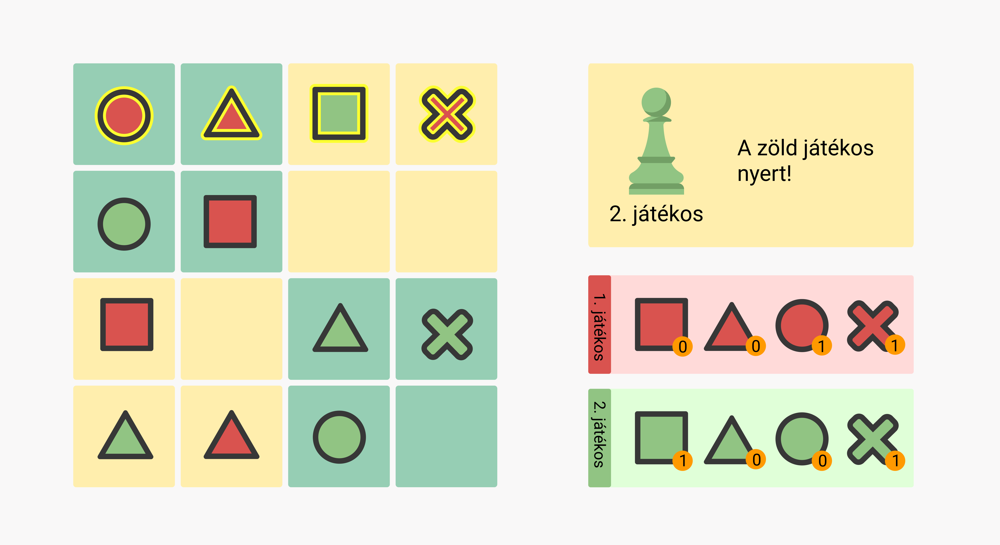

# QUANTIK

## Leírás
A játék egy 4x4-es táblán játszódik, ami 4 egyenlő, 2x2-es részre van bontva. A játékhoz négy, egymástól könnyen megkülönböztethető, alakzatot használhatunk, jelen esetben négyzetet, kört, háromszöget és X-et. Mind a két játékosnak minden alakzatból 2-2 bábuja van, így összesen 8 alakzat található meg egy színből. A célja az, hogy elsőként helyezzék le a játékosok a negyedik, többitől különböző formát egy sorba, oszlopba, vagy négyzet alakú területre.


Mivel a színek nem számítanak, nyerhetünk csupán úgy is, hogy mind a három másik alakzatot a másik játékos tette le, mi pedig a negyedik bábut helyeztük le.

|    |  |
:-------------------------:|:-------------------------:|
Ebben a játékban a piros játékos helyezte le a piros kört a második sorban, így a jobb felső területen lehelyezte a hiányzó alakzatot, és megnyerte a játékot. |  A zöld játékos helyezte le utoljára a zöld négyzetet az első sorban, így lehelyezve a hiányzó alakzatot abban a sorban, és megnyerte a játékot

## A játék megvalósítása

### Kezdőképernyő

A játéknak kétféle felhasználói felülete van:
- a *játék nyitólapja*, ami kezdetben jelenik meg, és a beállításokat tartalmazza; és
- a *játékoldal*, ahol játszani lehet.

Ugyan ezeket "oldal"-aknak hívjuk, mégsem kell ezeket külön HTML oldalon megvalósítani. Sőt, elvárás, hogy mindez egy HTML oldalon belül kerüljön megvalósításra, és pl. a kétféle "panel" megjelenésének változtatgatásával (pl. egy `div` `hidden` tulajdonságának programozásával) menjük egyik játékfázisból a másikba.

### A játék nyitólapja

A játék nyitólapján jelenjen meg 
- a játék neve
- legyen lehetőség  a játékszabály elolvasására (ugyanott, külön oldalon, elrejtve/felfedve, stb. módon),
- a játékosok nevének megadására,
- egy mentett játék folytatására.

**Két játékos** lehet. A nyitólapon megadható a nevük, alapértelmezetten "1. játékos" és "2. játékos" legyen.

Legyen egy lista a korábbi játékospárokkal feltöltve. A lista tartalmazza az adott pár nevét, illetve hogy hányszor nyert az egyik, hányszor a másik, hányszor volt döntetlen. A sorrend is fontos, azaz Piroska-Farkas és Farkas-Piroska különböző pár, mert mindig az 1. játékos kezd. A lista egy elemére kattintva a nevek automatikusan kitöltődnek. (Pl. Piroska-Farkas párra kattintva az első játékos helyére a Piroska, a 2. helyére a Farkas név kerül.) Ezzel megkönnyítjük a visszatérő játékospárok nevének beírását.

Ha vannak félbehagyott játékok, akkor azoknak a listája is ezen az oldalon jelenik meg. A lista egy eleme a mentés dátumát, és a kitöltés %-os arányát tartalmazza. Rákattintva az adott állás töltődik be.

Egy **"Start"** feliratú gomb lenyomására indul a játék.

### Játékoldal

- A játék indítása után megjelenik az üres tábla.
- Ha a játékot mentett állásból indítottuk, akkor az adott állás töltődik be.
- A felületen jelezni kell, hogy melyik játékos van soron. (Ezt talán legegyszerűbb színekkel jelezni.) Mindig az 1. játékos kezd.
- A bábuk lerakásakor az egeret a tábla felett húzogatva, az adott cellában megjelenik a bábu. Kattintásra a bábut le tudjuk helyezni a cellába.
- A korong pozícióját a jobbra-balra-fel-le nyilakkal is mozgathatjuk. Space vagy ENTER megnyomására a korong bedobásra kerül.
- Ha valamelyik játékosnak egy sorban, egy oszlopban, vagy egy területen összejön a 4 különböző alakzat, akkor az a játékos nyer, és a játék véget ér. A győztes játékos nevét írjuk ki. Majd egy kattintásra térjünk vissza a nyitólapra.
- Helyi tárolóba növeljük el az adott párnál a győztes játékos győzelmeinek számát.
- Ha döntetlen, akkor ezt kell kiírni, és növeljük a döntetlenek számát.
- A játék menet közben félbehagyható. Legyen egy "Mentés" gomb, amelyre kattintva a játékállapot mentésre kerül, és visszatérünk a nyitólapra.
- Ha egy korábban mentett játékot végigjátszunk, akkor az már ne jelenjen meg a mentett játékok listájában.

### Játéktér előkészítése

A játéktérnek a következő elemeket kell tartalmaznia:
- a pályát, ami egy 4x4-es négyzetrács, jelölve valamilyen módon a 4 külön területet
- az egyes játékosok adatait
  - hányadik játékos
  - milyen elemei maradtak hátra
  - az aktuális játékos jelzése

Az éppen soros játékost valamilyen módon jelezzük. Ő lép.

### A játék vége

A játék végén írjuk ki a győztes játékos számát, majd legyen lehetőség új játékot kezdeni.

### Plusz feladatok plusz pontokért

- **1 játékos mód**:
  - a játék nyitólapján lehessen ezt kiválasztani. 
  - ekkor a második játékos a gép lesz, aki valamilyen logika szerint dobja a korongot
  - a gép is emberi idő alatt végezze a dolgát, azaz kis idő teljen el az oszlop kiválasztása és a dobás között
- **Időlimit**
  - lehessen megadni a főoldalon egy időlimitet, amennyit egy-egy játékos összesen gondolkodhat a játék során. Ha ez letelt, akkor automatikusan veszít.
- **A játék mentése**
  - lehetőségünk félbehagyni és elmenteni az aktuális játékot a böngésző helyi tárolójába. A főképernyőn pedig jelezzük, ha van ilyen mentés, és legyen lehetőség a mentett játékot folytatni.

## További elvárások

Fontos az **igényes megjelenés**. Ez nem feltétlenül jelenti egy agyon csicsázott oldal elkészítését, de azt igen, hogy 1024x768 felbontásban és a fölött az elrendezés jól jelenjen meg, a kártyákban középre rendezetten és felismerhetően jelenjenek meg az ábrák. Ehhez lehet minimalista designt is alkalmazni, lehet különböző háttérképekkel és grafikus elemekkel felturbózott saját CSS-t készíteni, de lehet bármilyen CSS keretrendszer segítségét is igénybe venni.

Nincs elvárás arra vonatkozóan, hogy milyen **technológiá**val (táblázat, div-ek vagy canvas) oldod meg a feladatot, továbbá a megjelenést és működést illetően sincsenek kőbe vésett elvárások. A lényeg, hogy a fenti feladatok felismerhetők legyenek, és a játék jól játszható legyen.

Az időméréshez lehet használni a `Date.now()` metódust, ami ms-okban adja vissza az aktuális időt. A folyamatosan időkijelzéshez használj időzítőt!

## Segítség

Első lépésként alakítsd ki a játékhoz szükséges elemeket. Ha nem canvast használsz, akkor készítsd el a játék HTML és CSS statikus prototípusát. Kísérletezd ki és készítsd elő a szükséges elemeket:
- hogyan valósítod meg a rácsos elrendezést?
  - táblázat?
  - abszolútan pozícionált elemek?
  - flexbox?
  - CSS grid?
- hogyan raksz rá elemeket, hogy jól látható legyen?
  - szöveg?
  - szám?
  - szín?
  - kép?
  - kísérletezd ki, pl statikusan hover-rel az egeret föléhúzva
- a hátralévő elemeket hova rakod?
- hogyan jeleníted meg az egyes játékosok adatait?
- a kezdőképernyő hogyan néz ki?

Ezekhez mind nem kell programozás, hanem csak HTML és CSS.

A következő lépés, hogy találd ki, hogy a játékhoz milyen adatok szükségesek, és ezeket milyen adatszerkezetben tárolod?
- a játéktér
  - az alakzatok pozíciója
  - az alakzat típusa
- ki a következő játékos éppen

Ezeken milyen műveletekre lesz szükség?
- hogyan oldod meg az alakzatok lehelyezését
- a különböző ellenőrzéseket?
- stb

Milyen események lesznek az oldalon?
- esemény típusa?
- mi jelzi?
- milyen szinten kell kezelni?
- buborékolás és delegálás szükséges?

Egy nagyobb feladatnál nem látunk át előre mindent. A fenti lépéseket lehet részfeladatonként alkalmazni. A HTML, CSS fázist nem kell feltétlenül kis lépésekre bontani, meg lehet előre tervezni az egész felületet. A JavaScript logika fejlesztésénél viszont érdemes kis lépésekben haladni. Egyszerre egy dolog működjön.

## Pontozás

A feladat megoldásával 20 pont szerezhető. Vannak minimum elvárások, melyek teljesítése nélkül a beadandó nem elfogadható. A plusz feladatokért további 5 pont szerezhető. Azaz ha valaki mindent megcsinál a beadandóra 25 pontot kaphat.

### Minimálisan teljesítendő (enélkül nem fogadjuk el, 8 pont)

- Egyéb: A "További elvárások" részben szereplő `README.md` fájl megfelelően kitöltve szerepel a feltöltött csomagban (0 pont)
- Játéktér: A játéktér megjelenik. (0 pont)
- Játéktér: Egy 7x7-es rácsban megjelennek a fix elemek. (1 pont)
- Játéktér: Ugyanebben a rácsban megjelennek véletlenszerűen forgatva és elhelyezve a mozgatható elemek. (2 pont)
- Játéktér: A rácsra fel van helyezve legalább 3 kincs véletlen helyre (kivéve a sarkokat) (0,5 pont)
- Játéktér: A rácsra fel van helyezve legalább 1 játékos figurája (0,5 pont)
- Katakomba átalakítása: A kimaradt szoba becsúsztatható egy mozgatható sorba vagy oszlopba. A katakomba szobái helyesen változnak. (2 pont)
- Lépés: A figurával szabályosan lehet lépni a szomszédos mező valamelyikére. (2 pont)

### Az alap feladatok (12 pont)

- Kezdőképernyő: játékosszám beállítása (0,5 pont)
- Kezdőképernyő: játékosonkénti kincskártyák számának beállítása (0,5 pont)
- Kezdőképernyő: Start gombra megjelenik a játéktér (0,5 pont)
- Kezdőképernyő: megtekinthető a játékleírás (0,5 pont)
- Játéktér: a kincsek a beállításoknak megfelelően jelennek meg (0,5 pont)
- Játéktér: a figurák a sarkokban megjelennek (0,5 pont)
- Játéktér: kimaradt elem megjelenik (0,5 pont)
- Játéktér: játékosadatok megjelennek (0,5 pont)
- Játéktér: jelezve van, hogy melyik az aktuális játékos (0,5 pont)
- Katakomba átalakítása: a kimaradt szoba forgatható becsúsztatás előtt (0,5 pont)
- Katakomba átalakítása: a szobák eltolása animációval történik (1 pont)
- Katakomba átalakítása: a kincsek abban a szobában maradnak, ahova az elején generáltuk őket (0,5 pont)
- Katakomba átalakítása: leeső figura ciklikusan a másik oldalra kerül (0,5 pont)
- Lépés: a szomszédos elérhető szobák jelölése (0,5 pont)
- Lépés: a lépés animációval történik (1 pont)
- Lépés: ha elérendő kincskártyára lépünk, akkor a játékos adatlapja helyesen változik (0,5 pont)
- Lépés: ha minden kincs megvan, és a kiindulási pontra léptünk, akkor a játék vége van (0,5 pont)
- Lépés: több figura jól jelenik meg egy mezőn (0,5 pont)
- Vége: a győztes játékos száma megjelenik (0,5 pont)
- Vége: egy gombra kattintva a játék újrakezdhető a kezdőképernyőtől (0,5 pont)
- Egyéb: Igényes kialakítás (1 pont)
- **1 hét késés (-3 pont)**
- **2 hét késés (-6 pont)**
- **2 hétnél több késés (nincs elfogadva a beadandó, nincs jegy)**

### Plusz feladatok (plusz 5 pont)

- Lépés: minden elérhető szoba jelölése (3 pont)
- Mentés: játék közben egy gombra kattintva elmenthető az aktuális állapot (0,5 pont)
- Mentés: a kezdőképernyőn megjelenik, ha van mentett állapot (0,5 pont)
- Mentés: a kezdőképernyőn megjelenő mentett állapot betölthető (1 pont)

## További elvárások

- Az elkészült feladatot tömörítve, az összes szükséges állománnyal, illetve a program gyökérmappájában elhelyezett `README.md` fájllal együtt legkésőbb a határidőig kell feltölteni a Canvas rendszerbe.
- A játék megvalósításához NEM használható semmilyen keretrendszer, külső JavaScript könyvtár.
- A `README.md` fájlban szerepeljen a következő kijelentés (a <> jeleket nem kell beleírni):

  ```txt
  <Hallgató neve> 
  <Neptun kódja> 
  Webprogramozás - számonkérés
  Ezt a megoldást a fent írt hallgató küldte be és készítette a Webprogramozás kurzus számonkéréséhez.
  Kijelentem, hogy ez a megoldás a saját munkám. Nem másoltam vagy használtam harmadik féltől 
  származó megoldásokat. Nem továbbítottam megoldást hallgatótársaimnak, és nem is tettem közzé. 
  Az Eötvös Loránd Tudományegyetem Hallgatói Követelményrendszere 
  (ELTE szervezeti és működési szabályzata, II. Kötet, 74/C. §) kimondja, hogy mindaddig, 
  amíg egy hallgató egy másik hallgató munkáját - vagy legalábbis annak jelentős részét - 
  saját munkájaként mutatja be, az fegyelmi vétségnek számít. 
  A fegyelmi vétség legsúlyosabb következménye a hallgató elbocsátása az egyetemről.
  ```

- A `README.md` fájlban a kijelentés alatt egy üres sorral elválasztva szerepeljen az alábbi lista. Az egyes `[ ]` közötti szóközt cseréld le x-re azokra a részfeladatokra, amit sikerült (akár részben) megoldanod!

  ```txt
  Minimálisan teljesítendő (enélkül nem fogadjuk el, 8 pont)

  [ ] Egyéb: A "További elvárások" részben szereplő `README.md` fájl megfelelően kitöltve szerepel a feltöltött csomagban (0 pont)
  [ ] Játéktér: A játéktér megjelenik. (0 pont)
  [ ] Játéktér: Egy 7x7-es rácsban megjelennek a fix elemek. (1 pont)
  [ ] Játéktér: Ugyanebben a rácsban megjelennek véletlenszerűen forgatva és elhelyezve a mozgatható elemek. (2 pont)
  [ ] Játéktér: A rácsra fel van helyezve legalább 3 kincs véletlen helyre (kivéve a sarkokat) (0,5 pont)
  [ ] Játéktér: A rácsra fel van helyezve legalább 1 játékos figurája (0,5 pont)
  [ ] Katakomba átalakítása: A kimaradt szoba becsúsztatható egy mozgatható sorba vagy oszlopba. A katakomba szobái helyesen változnak. (2 pont)
  [ ] Lépés: A figurával szabályosan lehet lépni a szomszédos mező valamelyikére. (2 pont)

  Az alap feladatok (12 pont)

  [ ] Kezdőképernyő: játékosszám beállítása (0,5 pont)
  [ ] Kezdőképernyő: játékosonkénti kincskártyák számának beállítása (0,5 pont)
  [ ] Kezdőképernyő: Start gombra megjelenik a játéktér (0,5 pont)
  [ ] Kezdőképernyő: megtekinthető a játékleírás (0,5 pont)
  [ ] Játéktér: a kincsek a beállításoknak megfelelően jelennek meg (0,5 pont)
  [ ] Játéktér: a figurák a sarkokban megjelennek (0,5 pont)
  [ ] Játéktér: kimaradt elem megjelenik (0,5 pont)
  [ ] Játéktér: játékosadatok megjelennek (0,5 pont)
  [ ] Játéktér: jelezve van, hogy melyik az aktuális játékos (0,5 pont)
  [ ] Katakomba átalakítása: a kimaradt szoba forgatható becsúsztatás előtt (0,5 pont)
  [ ] Katakomba átalakítása: a szobák eltolása animációval történik (1 pont)
  [ ] Katakomba átalakítása: a kincsek abban a szobában maradnak, ahova az elején generáltuk őket (0,5 pont)
  [ ] Katakomba átalakítása: leeső figura ciklikusan a másik oldalra kerül (0,5 pont)
  [ ] Lépés: a szomszédos elérhető szobák jelölése (0,5 pont)
  [ ] Lépés: a lépés animációval történik (1 pont)
  [ ] Lépés: ha elérendő kincskártyára lépünk, akkor a játékos adatlapja helyesen változik (0,5 pont)
  [ ] Lépés: ha minden kincs megvan, és a kiindulási pontra léptünk, akkor a játék vége van (0,5 pont)
  [ ] Lépés: több figura jól jelenik meg egy mezőn (0,5 pont)
  [ ] Vége: a győztes játékos száma megjelenik (0,5 pont)
  [ ] Vége: egy gombra kattintva a játék újrakezdhető a kezdőképernyőtől (0,5 pont)
  [ ] Egyéb: Igényes kialakítás (1 pont)

  Plusz feladatok (plusz 5 pont)

  [ ] Lépés: minden elérhető szoba jelölése (3 pont)
  [ ] Mentés: játék közben egy gombra kattintva elmenthető az aktuális állapot (0,5 pont)
  [ ] Mentés: a kezdőképernyőn megjelenik, ha van mentett állapot (0,5 pont)
  [ ] Mentés: a kezdőképernyőn megjelenő mentett állapot betölthető (1 pont)
  ```

A megfelelően kitöltött `README.md` fájl nélkül a megoldást nem fogadjuk el!
